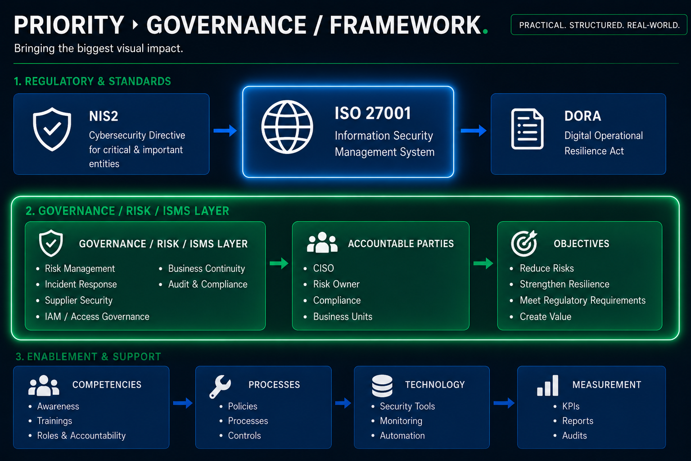

# Integrated Security & Compliance Mapping

> Integrated governance model showing how ISO 27001 supports modern regulatory, operational resilience, and enterprise security governance requirements across NIS2 and DORA.

## Overview

Modern organizations rarely operate under a single security or compliance framework.

In practice, information security governance often requires alignment across multiple standards, regulatory requirements, customer expectations, and internal governance models.

This section demonstrates how security frameworks can be aligned through a governance-oriented approach focused on:

- risk management
- audit readiness
- operational resilience
- management accountability
- regulatory harmonization
- integrated security governance

The objective is not to create legal interpretations of regulations.

Instead, the focus is on demonstrating how a structured ISMS and governance model can support multiple compliance and security requirements simultaneously.

---

## Why Framework Harmonization Matters

Organizations commonly face overlapping requirements from:

- ISO/IEC 27001
- NIS2
- DORA
- BSI IT-Grundschutz
- GDPR
- customer audits
- internal governance requirements

Without harmonization, this often leads to:

- duplicated controls
- fragmented documentation
- inconsistent responsibilities
- inefficient audits
- disconnected governance processes

A mature governance model should reduce complexity by aligning controls, processes, and risk management activities across multiple frameworks.

---

## Governance Perspective

Security governance is not only about implementing controls.

It is about creating a structured operating model for:

- identifying risks
- assigning responsibilities
- documenting decisions
- monitoring effectiveness
- supporting resilience
- enabling continual improvement

Framework mapping helps organizations understand where requirements overlap and how a single governance structure can support multiple expectations.

---

## Included Framework Alignments

| Mapping | Focus Area |
|---|---|
| ISO 27001 ↔ NIS2 | Cyber risk governance and regulatory readiness |
| ISO 27001 ↔ DORA | ICT risk management and operational resilience |
| ISO 27001 ↔ BSI Grundschutz | German governance and control alignment |
| NIST CSF ↔ ISO 27001 *(optional)* | International governance perspective |

---

## Governance Principles

The mappings in this section follow several core governance principles:

### Integrated Governance

Security controls should support multiple frameworks whenever possible.

### Risk-Based Decision Making

Security governance should prioritize business-relevant risks instead of checklist compliance.

### Audit Readiness

Processes and controls should be documented in a structured and reviewable way.

### Operational Resilience

Organizations should be able to continue operating during and after disruptive events.

### Continual Improvement

Governance structures should evolve based on lessons learned, audits, incidents, and changing risks.

---

## Related Portfolio Components

This section connects with additional governance and ISMS artifacts within this portfolio:

- ISMS Mini Implementation
- Risk Register
- Statement of Applicability (SoA)
- Incident Response Simulation
- IAM Risk Model
- Vulnerability Management Risk Model
- Policies & Procedures
- Governance Documentation

Together, these components demonstrate how security governance can be translated into practical operational structures and risk-based decision-making processes.

---

## Future Extensions

Potential future framework mappings may include:

- GDPR ↔ ISO 27001
- CIS Controls ↔ ISO 27001
- NIST CSF ↔ NIS2
- DORA ↔ Third-Party Risk Governance
- Business Continuity ↔ Operational Resilience Mapping

---

## Summary

Framework mapping is not purely a compliance exercise.

It is a governance capability.

The objective is to create integrated security structures that improve resilience, reduce duplicated effort, strengthen audit readiness, and support risk-informed management decisions across modern organizations.
