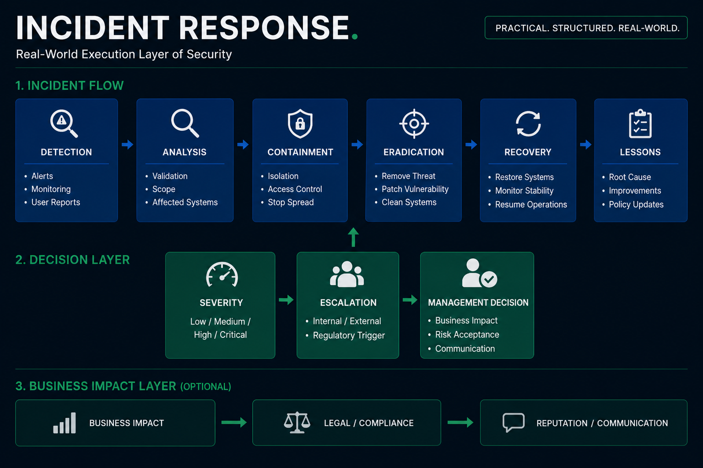

# Incident Response Simulation

See: [Executive Summary](./exec_summary.md)

---

## Objective

This project demonstrates how a security incident is handled from detection to recovery.

It complements the ISMS project by showing how theoretical risks translate into real-world incidents and response actions.

---

## Incident Response Overview

This diagram illustrates how a security incident is managed across technical and organizational layers.

It shows:

- A structured response lifecycle (Detection → Recovery)  
- Severity-based escalation and decision-making  
- Interaction between technical and business perspectives  
- Decision-making under real-world conditions  

---

## Structure

This repository represents a full incident lifecycle.

1. Scenario — How the attack occurs  
2. Timeline — How the incident unfolds  
3. Response — Technical handling of the incident  
4. Governance — Decision-making and escalation  
5. Lessons Learned — Improvements after the incident  

---

## Scenario

A ransomware attack compromises a production system through a vulnerable externally exposed service.

---

## Key Elements

- Incident detection  
- Technical response steps  
- Management decision-making  
- Business impact analysis  
- Lessons learned  

---

## Why this matters

Security is not only about preventing incidents.

It is about:

- Responding effectively under pressure  
- Making risk-based decisions with incomplete information  
- Balancing technical actions with business impact  
- Continuously improving controls and processes  

This simulation demonstrates how security operates in real-world conditions.
