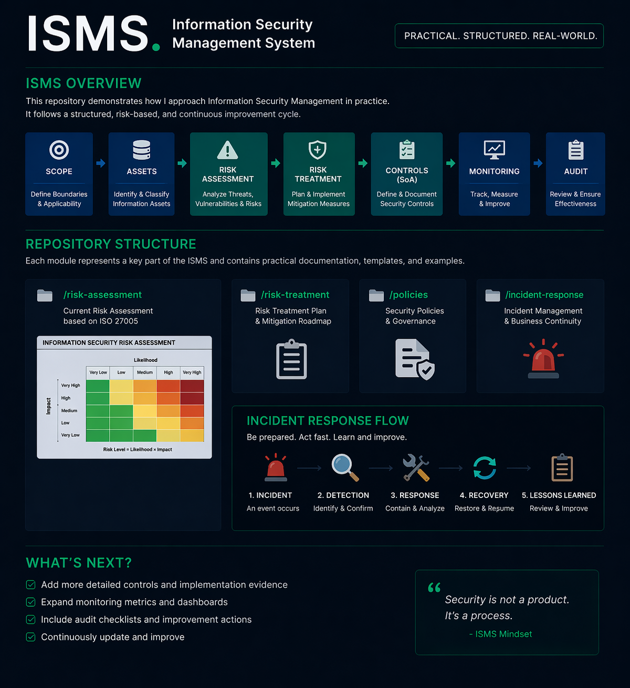

```txt
██╗███████╗███╗   ███╗███████╗     ██████╗ ██████╗  ██████╗      ██╗███████╗ ██████╗████████╗
██║██╔════╝████╗ ████║██╔════╝     ██╔══██╗██╔══██╗██╔═══██╗     ██║██╔════╝██╔════╝╚══██╔══╝
██║███████╗██╔████╔██║███████╗     ██████╔╝██████╔╝██║   ██║     ██║█████╗  ██║        ██║   
██║╚════██║██║╚██╔╝██║╚════██║     ██╔═══╝ ██╔══██╗██║   ██║██   ██║██╔══╝  ██║        ██║   
██║███████║██║ ╚═╝ ██║███████╗     ██║     ██║  ██║╚██████╔╝╚█████╔╝███████╗╚██████╗   ██║   
╚═╝╚══════╝╚═╝     ╚═╝╚══════╝     ╚═╝     ╚═╝  ╚═╝ ╚═════╝  ╚════╝ ╚══════╝ ╚═════╝   ╚═╝   
```

# ISMS Implementation Project (ISO 27001 aligned)

---

## Executive Summary

This project demonstrates the structured implementation of an Information Security Management System (ISMS) based on ISO 27001.

The focus is on translating security requirements into practical governance, risk-based decision-making, and implementable controls.


---

##  ISMS Overview



This diagram illustrates how an Information Security Management System (ISMS) is structured in practice.

It shows how security is implemented as a continuous lifecycle:

- Scope definition and asset identification  
- Risk assessment and prioritization  
- Risk treatment through controls  
- Continuous monitoring and improvement  

The ISMS provides the foundation for structured, risk-based decision-making across the organization.

However, security is only proven when real incidents occur.

👉 See how these risks materialize in practice:  
👉 [Incident Response Simulation](../incident-response-simulation/README.md)

---
## Business Scenario

The ISMS is designed for a mid-sized automotive supplier operating in a production-driven and regulated environment.

Key characteristics:

- High dependency on system availability  
- Integration with external suppliers  
- Handling of sensitive operational and customer data  
- Increasing use of cloud-based collaboration tools  

---

## My Role

- Structured the ISMS from scratch  
- Designed risk assessment methodology  
- Translated risks into actionable controls  
- Defined governance structures and policies  
- Ensured audit readiness and documentation  

---

## Key Outcomes

- Clear ISMS structure aligned with ISO 27001  
- Risk-based prioritization of security measures  
- Practical and implementable security policies  
- Defined responsibilities and governance model  
- Foundation for audit and continuous improvement  

---

## Approach

The implementation follows a consistent lifecycle:

1. Scope & Context Definition  
2. Asset Identification & Classification  
3. Risk Assessment (Likelihood × Impact)  
4. Risk Treatment & Control Selection  
5. Policy Definition & Governance Structuring  
6. Implementation & Documentation  
7. Monitoring & Continuous Improvement  
8. Audit Preparation  

---

## Key Components

### Scope & Context  
👉 `01_scope_context`  
Definition of business environment, assets, and stakeholders.

### Risk Assessment  
👉 `02_risk-assessment`  
Development of a qualitative risk model and evaluation process.

### Risk Treatment  
👉 `03_risk_treatment`  
Definition of mitigation strategies and control mapping.

### Policies  
👉 `05_policies`  
Security policies aligned with ISO 27001.

### Control Mapping  
👉 `06_control_mapping`  
Mapping controls to frameworks and requirements.

### Compliance Extension  
👉 `07_compliance_extension`  
Extension towards regulatory requirements.

### Audit Preparation  
👉 `08_audit`  
Preparation of audit artifacts and findings.

### Tabletop Exercise  
👉 `09_tabletop_exercise`  
Simulation of a ransomware scenario.

### Business Continuity  
👉 `10_business_continuity`  
Recovery strategies and continuity planning.

---

## Key Takeaways

- Security must align with business objectives  
- Risk-based decision-making is central  
- Clear structures enable implementation  
- Practicality beats theoretical completeness  
- Continuous improvement is essential  
